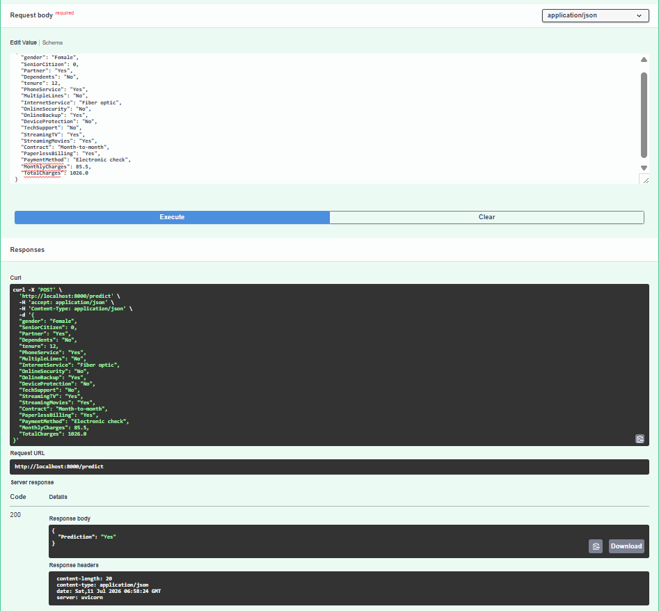
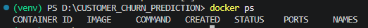

# 🚀 Customer Churn Prediction System

An end-to-end Machine Learning project that predicts whether a customer is likely to churn using a Scikit-learn Pipeline. The project includes experiment tracking with MLflow, REST API deployment using FastAPI, Docker containerization, and is ready for RENDER deployment.

---

## 🚀 Live Demo

🔗 **Live Application:** https://customer-churn-prediction-3-4my0.onrender.com

---

## 📌 Features

- Data Cleaning & Preprocessing
- Exploratory Data Analysis (EDA)
- Feature Engineering
- Scikit-learn Pipeline
- Logistic Regression Model
- MLflow Experiment Tracking
- FastAPI REST API
- Swagger UI Documentation
- Docker Containerization
- Ready for AWS Elastic Beanstalk Deployment

---

## 🛠 Tech Stack

- Python
- Pandas
- NumPy
- Scikit-learn
- MLflow
- FastAPI
- Pydantic
- Docker
- Git & GitHub
- AWS Elastic Beanstalk (Next)

---

## 📂 Project Structure

```
CUSTOMER_CHURN_PREDICTION
│
├── app
│   ├── main.py
│   ├── predictor.py
│   └── schema.py
│
├── artifacts
├── data
├── models
│   └── churn_pipeline.pkl
│
├── notebooks
├── src
│
├── Dockerfile
├── requirements.txt
├── README.md
└── .dockerignore
```

---](https://customer-churn-prediction-3-4my0.onrender.com)

## ⚙️ Installation

Clone the repository

```bash
git clone https://github.com/danish007777/Customer-Churn-Prediction.git

Move into the project

```bash
cd Customer_Churn_Prediction
```

Create virtual environment

```bash
python -m venv venv
```

Activate environment

Windows

```bash
venv\Scripts\activate
```

Install dependencies

```bash
pip install -r requirements.txt
```

---

## ▶️ Run FastAPI

```bash
uvicorn app.main:app --reload
```

Open

```
http://127.0.0.1:8000/docs
```

---

## 🐳 Docker

Build Image

```bash
docker build -t customer-churn-api .
```

Run Container

```bash
docker run -p 8000:8000 customer-churn-api
```

---

## 📊 MLflow

Run

```bash
python src/mlflow_tracking.py
```

Start MLflow UI

```bash
mlflow ui
```

Open

```
http://127.0.0.1:5000
```

---

## 🎯 API Endpoint

POST

```
/predict
```

Returns

```json
{
  "Prediction": "Yes"
}
```

or

```json
{
  "Prediction": "No"
}
```

---

## 📷 MLflow Dashboard


---

## 📷 Swagger UI


---

## 📷 Prediction API



---

## 🐳 Docker



---


## 📈 Future Improvements

- Hyperparameter Tuning
- XGBoost Deployment
- AWS Elastic Beanstalk Deployment
- CI/CD using GitHub Actions
- Streamlit Dashboard

---

## 👩‍💻 Author

**Danish Shaikh**

GitHub: https://github.com/danish007777/

LinkedIn: www.linkedin.com/in/danish-shaikh016
